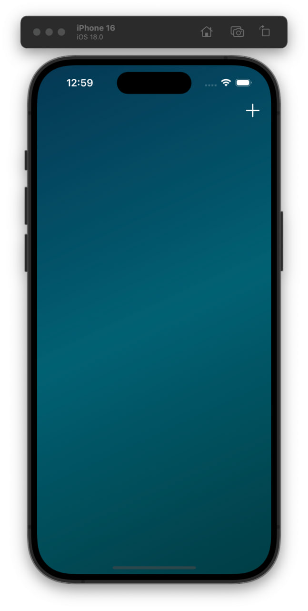
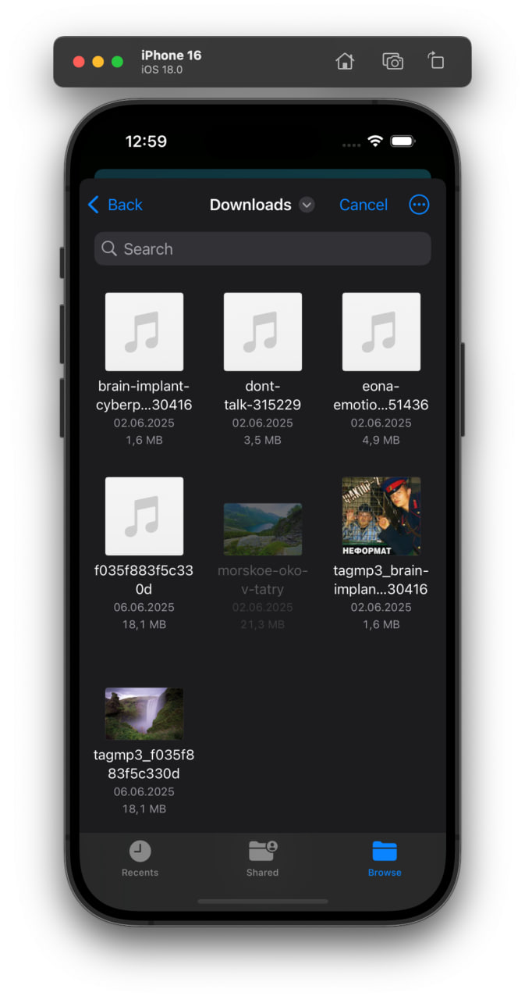
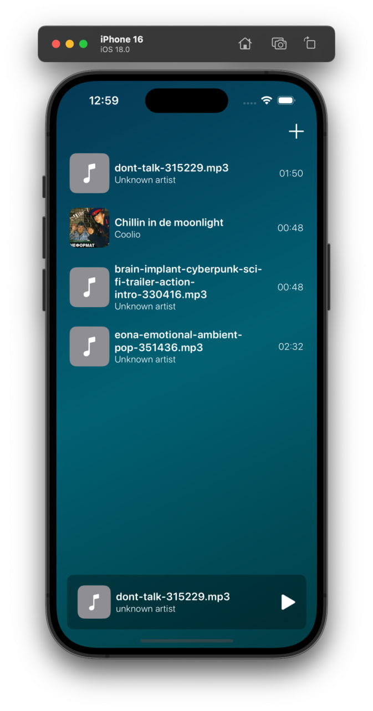
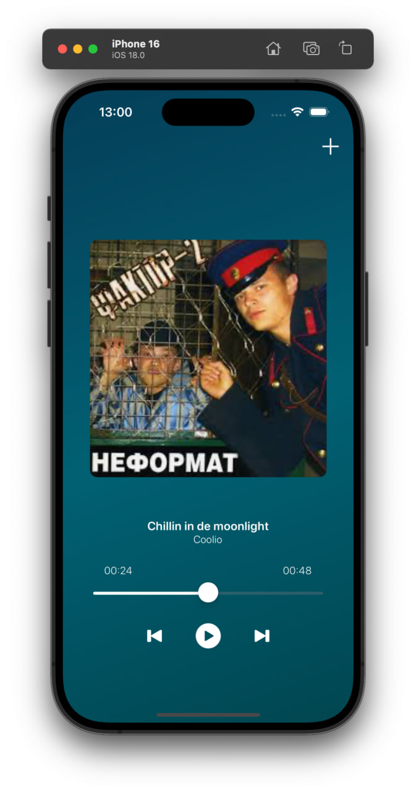

# NewsApp
iOS-приложение для воспроизведения локальных аудиофайлов с возможностью импорта через файловый менеджер.

## 🛠 Стек
- Swift 5, SwiftUI
- MVVM архитектура
- Использование паттерна Coordinator для интеграции SwiftUI и UIKit
- Работа с локальными аудиофайлами (AVFoundation)
- Realm для хранения данных
- Чистый код, модульная структура

## 📸 Скриншоты
<table>
<tr>
<td></td>
<td></td>
<td></td>
<td></td>
</tr>
</table>
